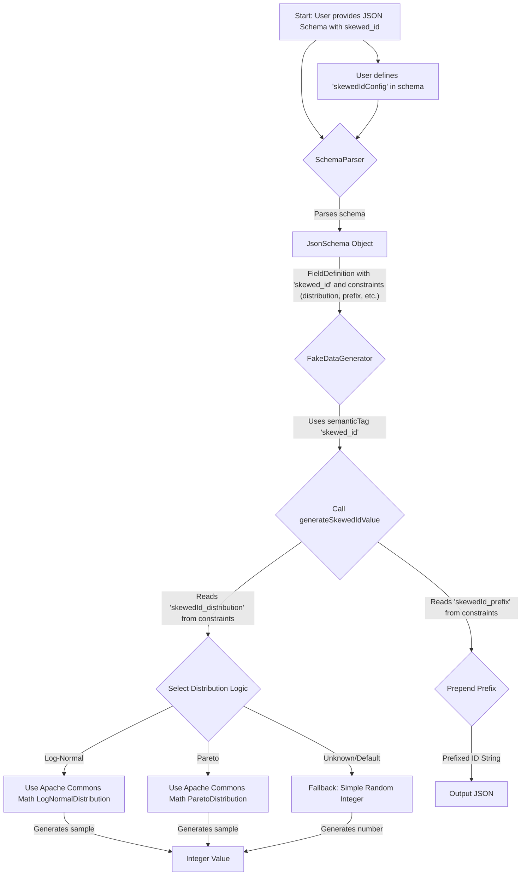

# Plan for Implementing `skewed_id` Semantic Tag

This document outlines the plan to introduce a new semantic tag, `skewed_id`, to the JSON Stream Faker project. This tag will enable the generation of string identifiers that include a random integer drawn from a non-uniform distribution (e.g., log-normal, Pareto) and an optional prefix.

## 1. Goal

The primary goal is to allow users to generate more realistic ID fields that simulate natural event occurrences, where some IDs appear more frequently than others.

## 2. JSON Schema Definition

The `skewed_id` will be configured within the JSON schema as follows:

```json
{
  "properties": {
    "userId": {
      "type": "string",
      "faker": "skewed_id",
      "description": "User ID with non-uniform distribution",
      "skewedIdConfig": {
        "distribution": "log-normal",  // e.g., "log-normal", "pareto"
        "prefix": "user-",             // Optional prefix
        // Future: distribution-specific parameters like scale, shape
        "logNormalScale": 1.0,         // Example for log-normal
        "paretoShape": 1.16            // Example for Pareto (alpha)
      }
    },
    "anotherId": {
      "type": "string",
      "faker": "skewed_id",
      "skewedIdConfig": {
        "distribution": "pareto"
        // No prefix, default distribution parameters
      }
    }
  }
}
```

-   `faker`: Set to `"skewed_id"`.
-   `skewedIdConfig`: A nested object containing parameters for the skewed ID generation.
    -   `distribution` (string, required): Specifies the type of non-uniform distribution (e.g., `"log-normal"`, `"pareto"`).
    -   `prefix` (string, optional): A string to prepend to the generated number.
    -   Additional optional parameters specific to the chosen distribution can be added here (e.g., `logNormalScale`, `paretoShape`).

## 3. Code Modifications

### 3.1. `JsonSchema.java` (No direct changes needed for `FieldDefinition`)

The existing `constraints` map within `JsonSchema.FieldDefinition` will be used to store the configuration from `skewedIdConfig`.

### 3.2. `SchemaParser.java`

The `parseFieldDefinition` method will be updated to:
1.  Check if `fieldNode.has("faker")` and its value is `"skewed_id"`.
2.  If it is, check for a nested object `fieldNode.get("skewedIdConfig")`.
3.  If `skewedIdConfig` exists:
    *   Extract `distribution` (e.g., `configNode.get("distribution").asText()`).
    *   Extract `prefix` (e.g., `configNode.has("prefix") ? configNode.get("prefix").asText() : null`).
    *   Extract any other distribution-specific parameters.
    *   Store these values in the `constraints` map of the `FieldDefinition`. To avoid key collisions and for clarity, they will be stored with a prefix, e.g.:
        *   `constraints.put("skewedId_distribution", "log-normal");`
        *   `constraints.put("skewedId_prefix", "user-");`
        *   `constraints.put("skewedId_logNormal_scale", 1.0);`

```java
// Inside SchemaParser.java, within parseFieldDefinition method

// ... (existing constraint parsing)

if ("skewed_id".equals(semanticTag) && fieldNode.has("skewedIdConfig")) {
    JsonNode configNode = fieldNode.get("skewedIdConfig");
    if (configNode.has("distribution")) {
        constraints.put("skewedId_distribution", configNode.get("distribution").asText());
    }
    if (configNode.has("prefix")) {
        constraints.put("skewedId_prefix", configNode.get("prefix").asText());
    }
    // Example for distribution-specific parameters
    if (configNode.has("logNormalScale")) {
        constraints.put("skewedId_logNormal_scale", configNode.get("logNormalScale").asDouble());
    }
    if (configNode.has("paretoShape")) {
        constraints.put("skewedId_pareto_shape", configNode.get("paretoShape").asDouble());
    }
    // Add more as needed
}

// ...
```

### 3.3. `FakeDataGenerator.java`

1.  **Add Dependency**: A library for statistical distributions, such as Apache Commons Math, will be added to `build.gradle`.
    ```gradle
    // build.gradle
    dependencies {
        // ... other dependencies
        implementation 'org.apache.commons:commons-math3:3.6.1' // Or latest version
    }
    ```

2.  **Modify `generateString` or `generateSemanticString`**:
    *   When `semanticTag` is `"skewed_id"`, retrieve the configuration from the `constraints` map:
        *   `String distributionType = (String) constraints.get("skewedId_distribution");`
        *   `String prefix = (String) constraints.getOrDefault("skewedId_prefix", "");`
        *   Retrieve distribution-specific parameters similarly.
    *   Call a new helper method, e.g., `generateSkewedIdValue(String distributionType, String prefix, Map<String, Object> constraints)`.

3.  **New Helper Method `generateSkewedIdValue`**:
    *   This method will use the `distributionType` to select the appropriate random number generation logic.
    *   It will instantiate and use distribution objects from the chosen library (e.g., `org.apache.commons.math3.distribution.LogNormalDistribution`, `org.apache.commons.math3.distribution.ParetoDistribution`).
    *   The parameters for these distributions will be retrieved from the `constraints` map (e.g., `skewedId_logNormal_scale`) or use sensible defaults if not provided.
    *   Generate an integer sample from the distribution. Ensure the generated number is positive and an integer (e.g., by taking `Math.abs((int) dist.sample())` or `Math.max(1, (int) dist.sample())`).
    *   Concatenate the `prefix` (if any) with the generated integer.
    *   Return the final string ID.
    *   Include error handling or fallbacks (e.g., if an unknown `distributionType` is specified, it could default to a simple random integer or throw an error).

```java
// Inside FakeDataGenerator.java

// Potentially add fields for distribution objects if they are to be reused
// private LogNormalDistribution logNormalDist;
// private ParetoDistribution paretoDist;

// In constructor or a new init method:
// if (schema_contains_skewed_id_with_log_normal) {
//     double scale = constraints.getOrDefault("skewedId_logNormal_scale", DEFAULT_SCALE);
//     double shape = constraints.getOrDefault("skewedId_logNormal_shape", DEFAULT_SHAPE);
//     this.logNormalDist = new LogNormalDistribution(scale, shape);
// }


private String generateSemanticString(String semanticTag, Map<String, Object> constraints) {
    switch (semanticTag) {
        // ... existing cases
        case "skewed_id":
            return generateSkewedIdValue(constraints);
        default:
            // For unrecognized tags, fall back to lorem
            return faker.lorem().sentence();
    }
}

private String generateSkewedIdValue(Map<String, Object> constraints) {
    String distributionType = (String) constraints.get("skewedId_distribution");
    String prefix = (String) constraints.getOrDefault("skewedId_prefix", "");

    if (distributionType == null) {
        // Fallback: generate a simple random number string if no distribution is specified
        return prefix + faker.number().randomNumber();
    }

    long number;
    switch (distributionType.toLowerCase()) {
        case "log-normal":
            // Retrieve params from constraints or use defaults
            double scale = (double) constraints.getOrDefault("skewedId_logNormal_scale", 1.0); // Example default
            double shape = (double) constraints.getOrDefault("skewedId_logNormal_shape", 0.5); // Example default
            org.apache.commons.math3.distribution.LogNormalDistribution logNormal =
                new org.apache.commons.math3.distribution.LogNormalDistribution(null, scale, shape); // Use default RNG or pass one
            number = Math.max(1, (long) logNormal.sample());
            break;
        case "pareto":
            // Retrieve params from constraints or use defaults
            double paretoScale = (double) constraints.getOrDefault("skewedId_pareto_scale", 1.0); // Location parameter
            double paretoShape = (double) constraints.getOrDefault("skewedId_pareto_shape", 1.16); // Alpha
             org.apache.commons.math3.distribution.ParetoDistribution pareto =
                new org.apache.commons.math3.distribution.ParetoDistribution(null, paretoScale, paretoShape);
            number = Math.max(1, (long) pareto.sample());
            break;
        default:
            // Fallback for unknown distribution
            System.err.println("Unknown distribution type for skewed_id: " + distributionType + ". Falling back to random number.");
            number = faker.number().randomNumber(7, false); // Generate a positive long
            break;
    }
    return prefix + number;
}

```

## 4. Documentation (`README.md`)

The `README.md` file will be updated:
1.  In the "Supported Semantic Tags" section, add `skewed_id` under an appropriate category (likely String Types).
2.  Add a new subsection explaining `skewed_id` and its `skewedIdConfig` object, detailing the `distribution` and `prefix` properties, and mentioning the possibility of distribution-specific parameters.
3.  Provide a clear example of how to use `skewed_id` in a JSON schema.

Example for README:
```markdown
### `skewed_id`

Generates a string identifier composed of an optional prefix and an integer drawn from a specified non-uniform distribution. This is useful for simulating IDs where some values are more common than others (e.g., popular users, frequently accessed items).

**Configuration via `skewedIdConfig` object:**

*   `distribution` (string, required): The type of non-uniform distribution. Supported values:
    *   `"log-normal"`: Log-normal distribution.
    *   `"pareto"`: Pareto distribution.
    *   *(More to be added in the future)*
*   `prefix` (string, optional): A string to prepend to the generated number (e.g., `"user-"`, `"item_"`).
*   Additional distribution-specific parameters can be provided (e.g., `logNormalScale`, `paretoShape`). Refer to library documentation for details if customizing beyond defaults.

**Example:**

```json
{
  "orderId": {
    "type": "string",
    "faker": "skewed_id",
    "skewedIdConfig": {
      "distribution": "log-normal",
      "prefix": "ORD-",
      "logNormalScale": 1.5, // Optional: specific parameter for log-normal
      "logNormalShape": 0.8  // Optional: specific parameter for log-normal
    }
  },
  "productId": {
    "type": "string",
    "faker": "skewed_id",
    "skewedIdConfig": {
      "distribution": "pareto"
      // Uses default parameters for Pareto and no prefix
    }
  }
}
```
```

## 5. Unit Tests

### 5.1. `SchemaParserTest.java`
*   Test parsing a schema with a `skewed_id` field, ensuring `skewedIdConfig` properties (`distribution`, `prefix`, and any distribution-specific params) are correctly stored in `FieldDefinition.constraints` with the `skewedId_` prefix.
*   Test parsing with missing optional `prefix`.
*   Test parsing with missing `skewedIdConfig` (should not break, `skewed_id` might fallback or error in generator).
*   Test parsing with an unknown distribution type (parser should still parse it, generator will handle fallback).

### 5.2. `FakeDataGeneratorTest.java`
*   Test `skewed_id` generation for `log-normal` distribution:
    *   Check if output starts with the correct `prefix` (if provided).
    *   Check if the part after the prefix is a number.
    *   (Advanced) Potentially run multiple generations and check if the distribution of numbers roughly follows expectations (this is harder to unit test precisely). For now, ensuring a positive integer is generated is key.
*   Test `skewed_id` generation for `pareto` distribution (similar checks).
*   Test with no `prefix`.
*   Test with missing `skewedId_distribution` in constraints (should fallback gracefully, e.g., to a simple random number).
*   Test with an unknown `distributionType` (should fallback gracefully).
*   Test with provided distribution-specific parameters.

## 6. Workflow Diagram



## 7. Future Considerations
*   Support for more distribution types.
*   More robust validation of distribution parameters.
*   Allowing users to specify all parameters for the chosen distribution (e.g., mean, stddev for normal, etc.) directly in `skewedIdConfig`.
*   Potentially caching initialized distribution objects in `FakeDataGenerator` if parameters are static for a given schema run, for performance.

This plan provides a comprehensive approach to implementing the `skewed_id` feature.